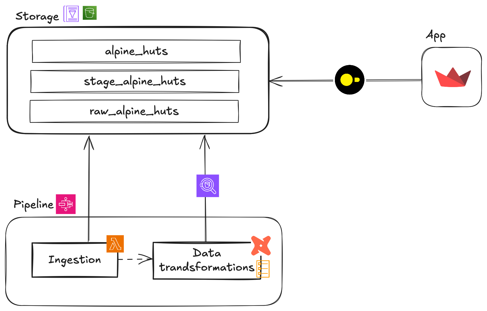

# Alpine huts

Loads hut availability data for analysis and exposes it in an app.

### Architecture



### Deployment
Is done with github actions. The scripts for the deployables are in their respective Makefiles.

- Deploy ingestion: Packages and and updates lambda function. `./ingestion/Makefile`
- Build data models: Builds dbt models
- Update dbt image: `./data/Makefile`
- Deploy infrastructure: Generates schema json for raw tables and deploys infrastructure. (`./Makefile`)


`````mermaid
flowchart TD
    detect_changes(Detect changes)
    deploy_infrastructure(Deploy infrastructure)
    deploy_ingestion(Deploy ingestion)
    update_dbt_image(Update dbt image)
    buid_data_models(Build data models)

    detect_changes --> deploy_infrastructure
    deploy_infrastructure --> deploy_ingestion
    deploy_infrastructure --> update_dbt_image
    deploy_infrastructure --> buid_data_models
`````
